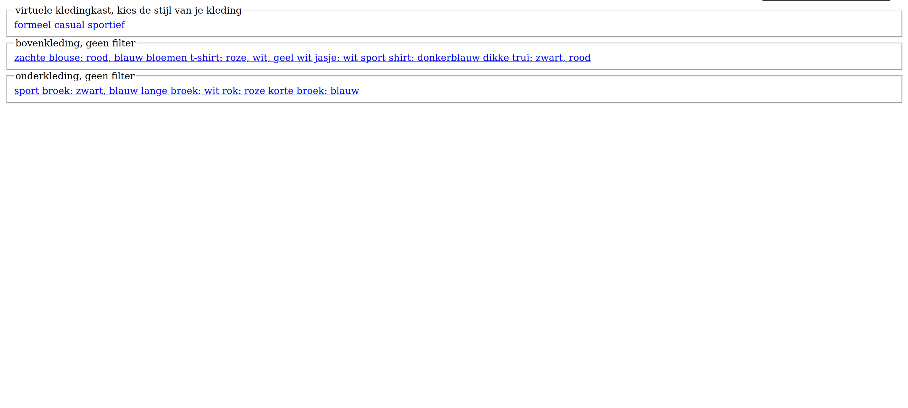

# Human Centered Design


<p align="center">
	
</p>

Voor dit project hebben we voor Petra, die blind is, een virtuele kledingkast gemaakt om haar te helpen met het uitzoeken van passende kleding.

## Inhoudsopgave
- Research
	- [Onderzoeksvraag](#onderzoeksvraag)
	- [Probleemdefinitie](#probleemdefinitie)
	- [Oplossing](#oplossing)
	- [Link prototype](#link-prototype)
- Technisch
  - [Installation](#installation)
  - [License](#license)

## Onderzoeksvraag

Hoe kan een virtuele kledingkast worden ingericht om het uitzoeken van kleding voor Petra te vergemakkelijken?

## Probleemdefinitie

Petra is blind. Omdat ze blind is, heeft ze soms moeite met het uitzoeken van passende kleding. Ze wil graag een digitale oplossing hebben die haar helpt met het uitzoeken van passende kleding.

## Oplossing

De oplossing die ik voor Petra heb bedacht is een virtuele kledingkast waarin ze kan filteren op de gelegenheid. De kledingstukken die dan voorgelezen worden, passen allemaal bij de gekozen gelegenheid. Ze krijgt ook informatie te horen over bijvoorbeeld de kleur van de kledingstukken. Wanneer ze uiteindelijk haar outfit heeft gekozen, krijgt ze te horen of de outfit bij elkaar past of niet.

## Link prototype
[human-centered-design-2223-hazel.vercel.app](https://human-centered-design-2223-hazel.vercel.app/)

## Documentatie van de Design Principles, User Needs, Tests en Testresultaten
- [Design Principles](<./docs/design principles.md>)
- [User Needs](<./docs/user needs.md>)
- [Tests](./docs/tests.md)

## Installatie

1. Clone de repository

```bash
$ git clone git@github.com:Laurens256/human-centered-design-2223.git
```

2. Navigeer naar de folder

```bash
$ cd FOLDER-NAME/human-centered-design-2223
```

3. Installeer de (dev)dependencies

```bash
$ npm install
```

4. Start de website in development mode

```bash
$ npm run dev
```

5. Open de website in je browser

```
http://localhost:3000/
```

## License

This project is licensed under the MIT License - see the [LICENSE](LICENSE) file for details.